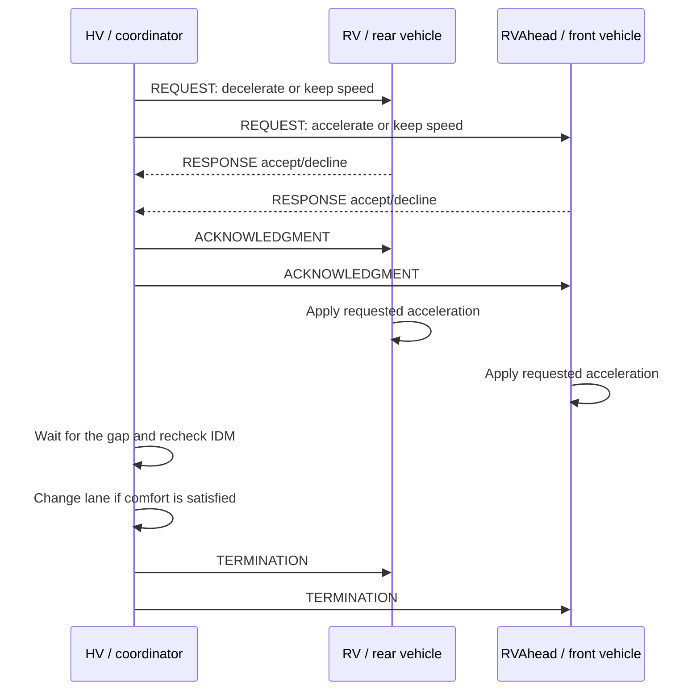

# FORESEE for ns-3/SUMO

This directory contains an **ns-3 + SUMO** implementation of FORESEE, a cooperative lane-change model for connected and automated vehicles.

FORESEE uses information received through V2X communications to estimate the traffic conditions ahead in each lane and make lane-change decisions that remain beneficial beyond the immediate surroundings of the ego vehicle. When a desired lane change is not immediately comfortable, this implementation adds an explicit **Maneuver Coordination Message (MCM)** negotiation: the vehicle ahead in the target lane can accelerate and the vehicle behind can decelerate to create a suitable gap.

> **Important**  
> This implementation is derived from the strategy-level model presented in *FORESEE: A Cooperative Lane Change Model for Connected and Automated Driving*, but it is not a literal reproduction of the paper. In particular, the paper discusses maneuver coordination as a potential extension, whereas this module implements the complete MCM negotiation procedure. Some equations and parameter values also differ from those used in the paper. These differences are documented in [Relationship with the paper](#relationship-with-the-paper).

## Directory contents

| File | Purpose |
|---|---|
| `foresee.h` | Declares the `ns3::foresee` class, data structures, parameters, negotiation state, and ns-3 events. |
| `foresee.cc` | Implements the FORESEE decision process, IDM checks, participant selection, MCM protocol, maneuver execution, and logging. |

The complete integration example is located at:

```text
src/automotive/examples/v2v-foresee-mcm-80211p.cc
```

The example expects the SUMO scenario files under:

```text
src/automotive/examples/sumo_files_v2v_foresee/
├── cars.rou.xml
└── map.sumo.cfg
```

## Model overview

Non-cooperative lane-change models such as MOBIL make decisions using mostly the state of the ego vehicle and its immediate neighbors. FORESEE instead uses the vehicles available in the Local Dynamic Map (LDM) to look farther ahead and estimate the future speed of each lane.

The estimated speed of a lane is the speed of the slowest observed vehicle ahead:

```text
v_lane = min(v_i)
```

The underlying assumption is that the slowest vehicle will determine the speed that following vehicles can maintain in the near future. FORESEE therefore attempts to:

- move vehicles with higher desired speeds toward the left lanes;
- move vehicles with lower desired speeds toward the right lanes;
- reduce speed differences, braking events, and ineffective lane changes;
- anticipate slowdowns and obstacles visible through V2X information.

The class operates at the **strategy level**: it decides whether and when a lane change should occur and coordinates the creation of a suitable gap. It does not calculate a continuous lateral trajectory.

## Vehicle roles

Three roles are used during a coordination:

| Role | Description |
|---|---|
| **HV** (*Host Vehicle*) | The ego vehicle that wants to change lanes. It acts as the maneuver coordinator. |
| **RV** (*Rear Vehicle*) | The vehicle immediately behind HV in the target lane. It may decelerate to enlarge the rear gap. |
| **RVAhead** | The vehicle immediately ahead of HV in the target lane. It may accelerate to enlarge the front gap. |

RV and RVAhead are searched within `MAX_DIST_AHEAD_BEHIND`, currently set to **50 m**, using bumper-to-bumper distances. A coordination can involve both vehicles, only one of them, or neither.

## Decision workflow

### 1. Initialization

Before starting the model, `WrapperFORESEEMobilityModel()` verifies that the following dependencies and parameters have been configured:

- the number of lanes;
- the Local Dynamic Map;
- the TraCI client;
- a valid desired speed;
- the Vehicle Data Provider (VDP);
- the MCM Basic Service and its reception callback;
- the ns-3 node associated with the vehicle.

The random-number generator is seeded with `seed + vehicleId`. The first FORESEE evaluation is then scheduled after `m_start_time`, which is set to **5000 ms** by the example.

### 2. Preliminary checks

Each execution of `FORESEEMobilityModel()` stops or postpones the decision process when:

- the vehicle has travelled more than **4850 m**, because it is considered too close to the end of the road;
- its current speed is already within `0.5 m/s` of its desired speed;
- it is already participating in another maneuver;
- the LDM does not contain useful connected vehicles;
- another maneuver coordination has been detected within the coordination-avoidance range.

The model normally performs another evaluation after **5 s**. If the vehicle is already travelling close to its desired speed, or after a completed maneuver, the next evaluation is scheduled after **10 s**.

### 3. Lane-speed estimation

The model reads the position, lane, speed, acceleration, vehicle type, and desired speed of connected vehicles from the LDM. Geographic positions are converted to the SUMO Cartesian reference system through TraCI.

For the strategy-level decision, the model considers vehicles travelling ahead in the same direction. It stores the minimum observed speed for each lane. If no other vehicle is observed ahead in the current lane, the current lane speed is assumed to be equal to the ego vehicle's desired speed.

### 4. Incentive criterion

The code evaluates a lane change to the left first. A change to the right is considered only if the left criterion is not satisfied. An adjacent lane is evaluated only when at least one vehicle has been observed in it.

The default thresholds are:

```text
delta_ls = 0.5 m/s
delta_ds = 0.5 m/s
offset   = 0.3
```

A left lane change is desired when:

1. the absolute difference between the estimated speeds of the left and current lanes exceeds `delta_ls`; and
2. the left lane is faster, **or** the ego vehicle's desired speed satisfies:

```text
v_desired > v_current_lane * (1 - offset) + delta_ds
```

A right lane change is desired when:

1. the absolute difference between the estimated speeds of the right and current lanes exceeds `delta_ls`; and
2. the right lane is faster, **or** the ego vehicle's desired speed satisfies:

```text
v_desired < v_right_lane * (1 - offset) - delta_ds
```

These are the conditions implemented by the current C++ code. They do not exactly match the equations in the paper, as explained in [Relationship with the paper](#relationship-with-the-paper).

### 5. Comfort criterion

After selecting a target lane, the model uses the **Intelligent Driver Model (IDM)** to estimate the acceleration that would result immediately after the lane change:

- the acceleration of HV when following RVAhead;
- the acceleration of RV when following HV.

The lane change is considered comfortable when the IDM acceleration does not fall below:

```text
MIN_DECELERATION = -2 m/s²
```

The IDM parameters depend on the station type:

| Vehicle type | `T` [s] | `s0` [m] | `a` [m/s²] | `b` [m/s²] | Exponent `d` |
|---|---:|---:|---:|---:|---:|
| Passenger car | 0.8 | 2.0 | 2.5 | 3.0 | 4.0 |
| Light truck | 1.1 | 2.0 | 1.5 | 2.5 | 4.0 |
| Heavy truck | 1.3 | 2.0 | 1.0 | 2.5 | 4.0 |
| Motorcycle | 0.6 | 2.0 | 3.0 | 3.5 | 4.0 |
| Bus | 1.3 | 2.0 | 1.5 | 2.5 | 4.0 |

The free-flow speed `v0` is set to the desired speed assigned to the individual vehicle.

### 6. Gap creation

If the comfort criterion is already satisfied, the corresponding cooperating vehicle is asked to maintain a constant speed (`acceleration = 0`) for the maneuver horizon.

If the comfort criterion is not satisfied, the current implementation tests two fixed longitudinal actions:

- **RVAhead:** `+2 m/s²`;
- **RV:** `-2 m/s²`.

`simulateCandidate()` propagates speed, position, and gap using a `0.1 s` time step over the maneuver horizon, which defaults to **5 s**. The action is considered successful when, within that horizon:

- the gap remains positive;
- the follower's IDM acceleration reaches at least `-1.8 m/s²`, corresponding to `MIN_DECELERATION + 0.2`.

The function also returns the first instant at which the condition is met. If the tested action cannot create a sufficient gap, it returns `NO_SOLUTION` and the coordination is not started.

### 7. Direct or coordinated lane change

- If neither RV nor RVAhead is found within 50 m, HV changes lane directly.
- If at least one cooperating vehicle is present and the required gap can be created, HV starts the MCM negotiation.
- If at least one required gap cannot be created within the maneuver horizon, the lane change is postponed.

The lane change is currently applied with `TraCIAPI::vehicle.moveTo()`. It is therefore a strategic lane reassignment rather than a continuous physical lateral trajectory.

## MCM protocol

The negotiation uses `MCBasicService` and an MCM extension named `ForeseeIndication`, which carries the requested longitudinal acceleration and its duration.



### Request

HV sends an MCM of type `request`, with the `coordinatingItss` role and the `localTrafficManagement` goal.

One maneuver advice is added for each cooperating vehicle:

- RV receives the `Slowdown` sub-maneuver;
- RVAhead receives the `Accelerate` sub-maneuver;
- both receive `stayInLane` as their advised lateral state.

MCM transmissions are desynchronized with a random delay between **1 and 5 ms**.

### Request evaluation

A target vehicle declines the request when:

- it is already busy with another maneuver;
- the predicted final speed would exceed its desired speed by more than `0.5 m/s`;
- it has already travelled more than 4850 m.

When accepting, the target temporarily disables SUMO's automatic speed control, maintains a constant speed, and replies with `response = accept`. A declined request uses:

- `agreementSeekingUnwanted` when the predicted final speed is too high;
- `unableToConform` for the other rejection cases.

### Acknowledgment and execution

The coordinator waits for all responses for at most `m_negotiation_time`, configured as **1100 ms** in the example. If every acceptance arrives earlier, the negotiation continues immediately.

After receiving the acknowledgment, each target applies the agreed acceleration. To compensate for SUMO actuation inaccuracies, the command is adjusted by `0.3 m/s²`:

```text
positive acceleration -> a + 0.3
negative acceleration -> a - 0.3
```

After completing the requested action, the target maintains a constant speed while waiting for the termination message.

### Final verification and termination

HV waits for the longest action requested from its cooperating vehicles, reads fresh data from the LDM, and evaluates the IDM comfort criterion again using the updated gaps.

- If the criterion is satisfied for every cooperating vehicle, HV moves to the selected lane.
- If the criterion is not satisfied, the lane change is cancelled.

In both cases, HV sends an MCM `termination`, releases the target vehicles, and restores the default SUMO speed mode (`31`). After **150 ms**, `checkLane()` verifies that HV is actually in the requested lane.

## Conflict handling and timeouts

The module attempts to prevent nearby maneuver coordinations from overlapping:

- when a vehicle receives a request not addressed to it, it records the coordination if the coordinator is behind it, travelling in the same direction, and within `m_ca_range`;
- the example sets `m_ca_range = 200 m`;
- while that coordination remains registered, the vehicle does not start another one;
- records expire after **9 s** and are cleaned every **1 s**;
- a `termination` message removes the corresponding record immediately.

Two recovery mechanisms are also implemented:

- if a target accepts a maneuver but does not receive the acknowledgment within `m_negotiation_time + 200 ms`, it releases itself and reschedules FORESEE;
- if a termination message is not received after execution, a watchdog releases the target after the maneuver horizon plus 500 ms.

`deleteEvents()` invalidates the shared `m_alive` flag and cancels pending events when a vehicle leaves the simulation.

## Integration in the 802.11p example

The provided example configures a coupled ns-3/SUMO simulation with:

- IEEE 802.11p using a 10 MHz channel and `OfdmRate6MbpsBW10MHz` by default;
- CAM dissemination to populate the LDM;
- MCM exchange to negotiate maneuvers;
- a TraCI synchronization interval of `0.01 s`;
- a V2X penetration rate of 100%;
- autonomous SUMO lane changes disabled with `laneChangeMode = 256`.

For each vehicle created by SUMO, the `setupNewWifiNode` callback:

1. creates the GeoNetworking socket and `BSContainer`;
2. configures CAM, MCM, LDM, and VDP services;
3. assigns a station type and desired speed;
4. configures one `foresee` instance;
5. registers its MCM reception callback;
6. starts FORESEE and CAM dissemination.

Desired speeds are sampled from uniform distributions with the following means and deviations:

| SUMO type | Mean speed | Deviation |
|---|---:|---:|
| `Car0` | 33.3 m/s (approximately 120 km/h) | ±25% |
| `LightTruck` / `light_truck` | 27.7 m/s (approximately 100 km/h) | ±20% |
| `HeavyTruck` / `heavy_truck` | 22.2 m/s (approximately 80 km/h) | ±15% |
| `Motorcycle` / `motorcycle` | 36.1 m/s (approximately 130 km/h) | ±30% |
| `Bus` / `bus` | 25.0 m/s (approximately 90 km/h) | ±15% |

### Minimum class configuration

The initialization order used by the example is a useful reference:

```cpp
foresee& model = lc_model[nodeId];

model.setDesiredSpeed(desiredSpeed);
model.setNode(node);
model.setStationType(stationType);
model.setLDM(bsContainer->getLDM());
model.setVDP(bsContainer->getVDP());
model.setVehicleID(vehicleId);
model.setTraciAPI(sumoClient);
model.setNumberOfLanes();
model.setCoordinationAvoidanceRange(200.0);
model.setMCBasicService(bsContainer->getMCBasicService());
model.addMCMRxCallback();
model.setStartTime(5000);
model.setNegotiationTime(1100);
model.setVerbose(true);
model.setSeed(seed);
model.WrapperFORESEEMobilityModel(true);
```

To collect the coordination dataset, also call:

```cpp
model.setRegisterLog();
```

### Running the example

From the root of the ns-3 project, with SUMO available on the system and the scenario files in the paths listed above, a typical run is:

```bash
./ns3 run "v2v-foresee-mcm-80211p --sim-time=150 --seed=42"
```

To start the SUMO graphical interface:

```bash
./ns3 run "v2v-foresee-mcm-80211p --sumo-gui=1"
```

If the ns-3 fork uses a different build wrapper, keep the example name and command-line options unchanged.

### Main command-line options

| Option | Default | Description |
|---|---:|---|
| `--phyMode` | `OfdmRate6MbpsBW10MHz` | IEEE 802.11p modulation. |
| `--verbose` | `false` | Enables Wi-Fi model logs. |
| `--verbose-foresee` | `true` | Enables FORESEE state messages. |
| `--register-log-foresee` | `false` | Enables the coordination CSV file. |
| `--userpriority` | `0` | EDCA User Priority for ETSI messages. |
| `--baseline` | `150 m` | Reference distance used for PRR calculation. |
| `--tx-power` | `33 dBm` | Transmission power. |
| `--sim-time` | `150 s` | Duration of the ns-3 simulation. |
| `--sumo-gui` | `false` | Starts SUMO with its GUI. |
| `--seed` | `42` | Seed shared by the scenario, SUMO, and FORESEE. |

At the end of the simulation, the example prints the average CBR, total transmissions and receptions, average PRR, and MCM-specific statistics.

## Coordination logging

With `--register-log-foresee=1`, the example creates:

```text
coordinations_seed<SEED>_new.csv
```

The dataset contains, among other values:

- desired speeds of HV, RV, and RVAhead;
- minimum speeds of the current and target lanes;
- types of the participating and neighboring vehicles;
- bumper-to-bumper gaps;
- relative desired speeds, speeds, and accelerations;
- requested accelerations and durations;
- the coordination outcome.

The sentinel value `-2000` represents unavailable data. In the current implementation, `execution_success` has the following effective values:

| Value | Meaning |
|---:|---|
| `0` | The comfort condition was not reached after cooperation; the lane change was cancelled. |
| `1` | The negotiation was declined because the requested action was not convenient. |
| `2` | The lane-change command was issued, but the vehicle was not found in the target lane. |
| `3` | The lane change was completed successfully. |

This mapping reflects the assignments currently performed in `foresee.cc` and differs from the comment in the `CoordinationLog` structure in the header.

The records accumulated for a vehicle are appended to the CSV file when the SUMO shutdown callback removes that vehicle from the simulation.

## Relationship with the paper

The implementation preserves the central ideas of the paper:

- decentralized decision-making;
- look-ahead estimation of lane speeds using V2X information;
- lane organization according to vehicle desired speeds;
- a separate incentive criterion and comfort criterion;
- IDM-based evaluation of the longitudinal effect of a lane change;
- optimization of traffic efficiency rather than only the ego vehicle's instantaneous gain.

## Assumptions and known limitations

- Conversion between ETSI lane numbering and TraCI lane indices uses `3 - target_lane`; the implementation therefore assumes a **three-lane** scenario.
- The ahead/behind and direction checks assume a straight road with headings close to **90° or 270°**.
- The 4850 m distance limit is tied to the 5 km highway scenario and should be made configurable for other maps.
- An empty adjacent lane does not trigger the incentive criterion because the code evaluates an adjacent lane only when an observed vehicle is present in it.
- Decision quality depends on the completeness and freshness of the LDM and therefore on CAM reception, packet loss, and V2X penetration rate.
- `MAX_DIST_AHEAD_BEHIND = 50 m` limits the search for cooperating vehicles even when the LDM covers a larger area.
- The example enables PCAP capture on device index `22`; the scenario must contain at least 23 nodes, or that line must be changed.
- `moveTo()` does not model lateral dynamics, lateral comfort, or trajectory planning.
- `lambda` does not currently influence acceleration selection because the weighted optimization is disabled.
- CSV records are written during individual vehicle shutdown; the application should verify that records belonging to vehicles still active when the simulation time expires are also flushed.

## Parameters worth exposing

For use in different scenarios, the following values should preferably be exposed as ns-3 attributes or command-line options:

- lane-speed look-ahead range;
- RV and RVAhead search range;
- `delta_ls`, `delta_ds`, and `offset`;
- comfort threshold;
- gap-simulation horizon and time step;
- candidate accelerations;
- coordination-avoidance range and timeout;
- road length and minimum distance from its end;
- interval between FORESEE evaluations.

## Reference

R. Molina-Masegosa, S. S. Avedisov, M. Sepulcre, J. Gozalvez, Y. Z. Farid, and O. Altintas, “FORESEE: A Cooperative Lane Change Model for Connected and Automated Driving,” *IEEE Transactions on Vehicular Technology*, vol. 75, no. 9, pp. 19064-19075, September 2026. DOI: [10.1109/TVT.2026.3684626](https://doi.org/10.1109/TVT.2026.3684626).
